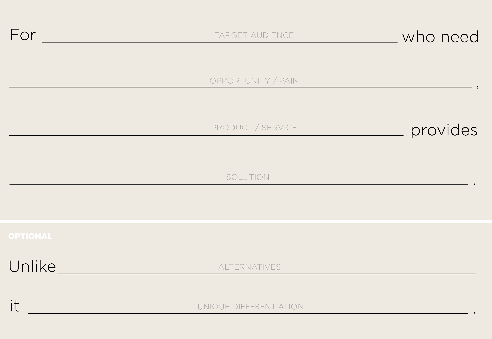


# Where to Start?
## 1. Identify your project vision
Plan a vision statement with the team.
This is going to help bring a shared understanding and a clear idea of the software being built.
### Benefits
Everyone is on  board and clear.
### Things to watch out for
Are we building the right product or service?
### Resources
This is a useful format for producing a vision statement
         
    - Here is a larger version to [download](resources/elevator-pitch.png).
- Enter it into JIRA
## 2. Setup a team and invite them
- Invite the team to JIRA and Confluence
## 3. [Follow SCRUM BASICS](scrum-basics.md)
