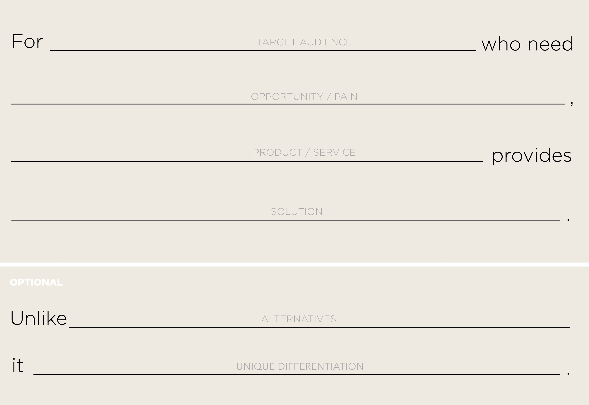

# Where to Start?
## 1. Identify your project vision
- Work with your team to build a vision statement
    - This is a useful format for producing a vision statement
        

- Enter it into JIRA
## 2. Setup a team and invite them
